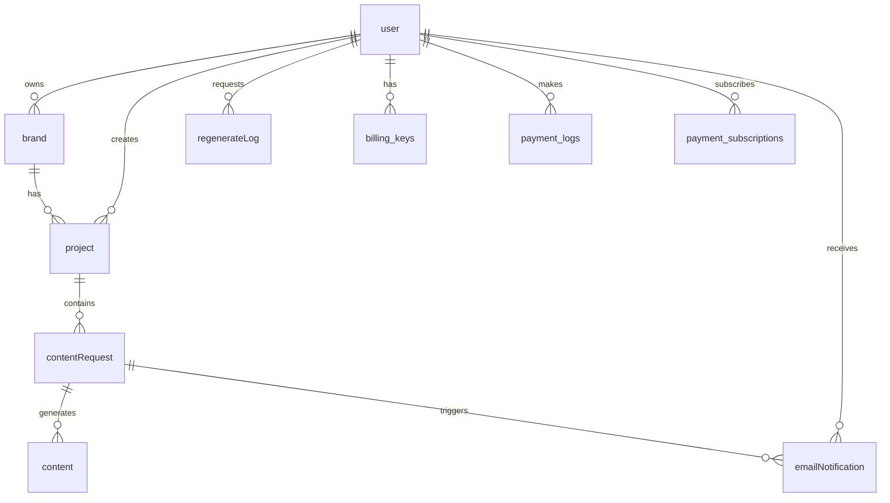

# Amond Database Schema Documentation

## Overview
The Amond database is designed to support a content generation and management platform with AI-powered features. The system handles users, brands, projects, content generation, payments, and notifications.

## Database Connection Details
- **Host**: 127.0.0.1 (localhost)
- **Database Name**: amond
- **User**: root
- **Character Set**: utf8mb4
- **Timezone**: Asia/Seoul

## Table Descriptions

### 1. **user** (사용자)
Core user table storing authentication and membership information.

| Column | Type | Description |
|--------|------|-------------|
| **id** | int (PK) | 사용자 고유 식별자 |
| **authType** | varchar(6) | 인증 유형 (local, google, kakao) |
| **socialId** | varchar(100) | 소셜 로그인 ID (구글/카카오) |
| **password** | varchar(200) | 비밀번호 (local 로그인용, 암호화됨) |
| **email** | varchar(200) | 이메일 주소 |
| **emailDuplicate** | varchar(200) | 중복 이메일 체크용 필드 |
| **grade** | varchar(20) | 회원 등급 (basic, premium 등) |
| **status** | varchar(5) | 계정 상태 |
| **lastLoginAt** | datetime | 마지막 로그인 시간 |
| **createdAt** | datetime | 가입일시 |
| **membershipStartDate** | datetime | 멤버십 시작일 |
| **membershipEndDate** | datetime | 멤버십 종료일 |
| **membershipStatus** | enum | 멤버십 상태 (active/expired/cancelled) |
| **sessionToken** | varchar(255) | 세션 토큰 (API 인증용) |
| **tokenUpdatedAt** | datetime | 토큰 업데이트 시간 |

### 2. **brand** (브랜드)
Stores brand information that users manage.

| Column | Type | Description |
|--------|------|-------------|
| **id** | int (PK) | 브랜드 고유 식별자 |
| **name** | varchar(255) | 브랜드명 |
| **category** | varchar(255) | 브랜드 카테고리 |
| **url** | varchar(512) | 브랜드 웹사이트 URL |
| **description** | text | 브랜드 설명 |
| **fk_userId** | int (FK→user.id) | 브랜드 소유자 |
| **createdAt** | datetime | 생성일시 |
| **updatedAt** | datetime | 수정일시 |

### 3. **project** (프로젝트)
Projects are working sessions for content creation tied to brands.

| Column | Type | Description |
|--------|------|-------------|
| **id** | int (PK) | 프로젝트 고유 식별자 |
| **name** | varchar(30) | 프로젝트명 (브랜드명과 동일) |
| **sessionName** | varchar(255) | 세션명 (브랜드명 + 생성시간) |
| **category** | varchar(20) | 프로젝트 카테고리 |
| **url** | varchar(300) | 관련 URL |
| **imageList** | varchar(1000) | 업로드된 이미지 목록 (콤마 구분) |
| **reasonList** | varchar(100) | 프로젝트 이유/목적 목록 |
| **description** | varchar(1000) | 프로젝트 상세 설명 |
| **createdAt** | datetime | 생성일시 |
| **fk_userId** | int (FK→user.id) | 프로젝트 소유자 |
| **fk_brandId** | int (FK→brand.id) | 연결된 브랜드 |
| **lastAccessedAt** | datetime | 마지막 접근 시간 |
| **isActive** | tinyint(1) | 활성화 상태 (1=활성, 0=비활성) |

### 4. **contentRequest** (콘텐츠 요청)
Stores content generation requests with parameters.

| Column | Type | Description |
|--------|------|-------------|
| **id** | int (PK) | 콘텐츠 요청 고유 식별자 |
| **trendIssue** | varchar(45) | 트렌드 이슈 키워드 |
| **snsEvent** | varchar(45) | SNS 이벤트 정보 |
| **essentialKeyword** | varchar(45) | 필수 키워드 |
| **competitor** | varchar(250) | 경쟁사 정보 |
| **uploadCycle** | varchar(5) | 업로드 주기 |
| **toneMannerList** | varchar(60) | 톤앤매너 목록 |
| **imageVideoRatio** | tinyint | 이미지/비디오 비율 |
| **imageRatio** | varchar(5) | 이미지 비율 |
| **directionList** | varchar(25) | 콘텐츠 방향성 목록 |
| **searchResult** | varchar(800) | 검색 결과 |
| **searchToken** | smallint | 검색 사용 토큰 수 |
| **subjectToken** | smallint | 제목 생성 토큰 수 |
| **createdAt** | datetime | 생성일시 |
| **fk_projectId** | int (FK→project.id) | 연결된 프로젝트 |

### 5. **content** (콘텐츠)
Generated content details.

| Column | Type | Description |
|--------|------|-------------|
| **id** | int (PK) | 콘텐츠 고유 식별자 |
| **postDate** | datetime | 게시 예정일 |
| **subject** | varchar(60) | 콘텐츠 제목 |
| **imageUrl** | varchar(200) | 생성된 이미지 URL |
| **aiPrompt** | varchar(300) | AI 이미지 생성 프롬프트 |
| **caption** | varchar(500) | 콘텐츠 캡션/설명 |
| **videoScript** | varchar(500) | 비디오 스크립트 |
| **imageToken** | smallint | 이미지 생성 사용 토큰 |
| **textToken** | smallint | 텍스트 생성 사용 토큰 |
| **imageLog** | text | 이미지 생성 로그 |
| **fk_contentRequestId** | int (FK→contentRequest.id) | 연결된 콘텐츠 요청 |
| **direction** | varchar(50) | 콘텐츠 방향성 (기본값: '정보형') |

### 6. **aiPrompt** (AI 프롬프트)
Stores AI prompt templates.

| Column | Type | Description |
|--------|------|-------------|
| **id** | int (PK) | 프롬프트 고유 식별자 |
| **name** | varchar(20) | 프롬프트 이름 |
| **prompt** | varchar(3000) | 프롬프트 내용 |
| **required** | varchar(300) | 필수 요구사항 |

### 7. **regenerateLog** (재생성 로그)
Tracks content regeneration history.

| Column | Type | Description |
|--------|------|-------------|
| **id** | int (PK) | 로그 고유 식별자 |
| **caption** | tinyint | 캡션 재생성 여부 (0/1) |
| **image** | tinyint | 이미지 재생성 여부 (0/1) |
| **all** | tinyint | 전체 재생성 여부 (0/1) |
| **createdAt** | datetime | 재생성 일시 |
| **fk_userId** | int (FK→user.id) | 요청 사용자 |

### 8. **membership_tiers** (멤버십 등급)
Defines available membership tiers and their features.

| Column | Type | Description |
|--------|------|-------------|
| **id** | int (PK) | 등급 고유 식별자 |
| **tier_name** | varchar(20) | 등급 이름 (내부용) |
| **tier_display_name** | varchar(50) | 등급 표시 이름 |
| **monthly_price** | int | 월 요금 |
| **monthly_grid_sets** | int | 월 그리드 세트 수 |
| **content_edit_limit** | int | 콘텐츠 편집 제한 |
| **planning_sets_limit** | int | 기획 세트 제한 |
| **manager_support** | tinyint(1) | 매니저 지원 여부 |
| **team_management** | tinyint(1) | 팀 관리 기능 여부 |
| **is_active** | tinyint(1) | 활성화 상태 |
| **created_at** | datetime | 생성일시 |

### 9. **payment_subscriptions** (결제 구독)
Manages user subscriptions.

| Column | Type | Description |
|--------|------|-------------|
| **id** | int (PK) | 구독 고유 식별자 |
| **fk_userId** | int (FK→user.id) | 구독 사용자 |
| **planType** | varchar(20) | 플랜 유형 |
| **status** | enum | 상태 (active/suspended/cancelled/expired) |
| **startDate** | date | 시작일 |
| **nextBillingDate** | date | 다음 결제일 |
| **price** | int | 가격 |
| **billingCycle** | enum | 결제 주기 (monthly/yearly) |
| **createdAt** | datetime | 생성일시 |
| **updatedAt** | datetime | 수정일시 |

### 10. **billing_keys** (빌링 키)
Stores payment method information for recurring billing.

| Column | Type | Description |
|--------|------|-------------|
| **id** | int (PK) | 빌링키 고유 식별자 |
| **fk_userId** | int (FK→user.id) | 사용자 |
| **orderNumber** | varchar(100) | 주문번호 |
| **billingKey** | varchar(255) | 이니시스 빌링키 |
| **cardNumber** | varchar(20) | 카드번호 (마스킹됨) |
| **cardName** | varchar(50) | 카드사명 |
| **status** | enum | 상태 (active/inactive) |
| **createdAt** | datetime | 생성일시 |
| **updatedAt** | datetime | 수정일시 |

### 11. **payment_logs** (결제 로그)
Records all payment transactions.

| Column | Type | Description |
|--------|------|-------------|
| **id** | int (PK) | 결제 로그 고유 식별자 |
| **fk_userId** | int (FK→user.id) | 결제 사용자 |
| **orderNumber** | varchar(100) | 주문번호 |
| **billingKey** | varchar(255) | 사용된 빌링키 |
| **price** | int | 결제 금액 |
| **goodName** | varchar(200) | 상품명 |
| **buyerName** | varchar(100) | 구매자명 |
| **buyerTel** | varchar(20) | 구매자 전화번호 |
| **buyerEmail** | varchar(100) | 구매자 이메일 |
| **paymentStatus** | enum | 결제 상태 (success/failed/cancelled/refunded) |
| **inicisResponse** | json | 이니시스 응답 데이터 |
| **createdAt** | datetime | 결제일시 |

### 12. **emailNotification** (이메일 알림)
Manages email notifications for content creation.

| Column | Type | Description |
|--------|------|-------------|
| **id** | int (PK) | 알림 고유 식별자 |
| **fk_userId** | int (FK→user.id) | 사용자 |
| **fk_contentRequestId** | int (FK→contentRequest.id) | 콘텐츠 요청 |
| **email** | varchar(255) | 수신 이메일 주소 |
| **status** | enum | 상태 (pending/sent/failed) |
| **createdAt** | datetime | 생성일시 |
| **sentAt** | datetime | 발송일시 |

## Foreign Key Relationships



## Hierarchy Visualization

```
User (e.g., John Doe)
├── Brand 1 (e.g., Nike)
│   ├── Project 1 (Nike - 2024-01-15 10:30)
│   │   ├── Content Request 1
│   │   │   └── Generated Content (Image + Caption)
│   │   └── Content Request 2
│   │       └── Generated Content (Image + Caption)
│   └── Project 2 (Nike - 2024-01-20 14:00)
│       └── Content Request 3
│           └── Generated Content (Image + Caption)
├── Brand 2 (e.g., Adidas)
│   └── Project 3 (Adidas - 2024-01-18 09:00)
│       └── Content Request 4
│           └── Generated Content (Image + Caption)
└── Brand 3 (e.g., Puma)
    ├── Project 4 (Puma - 2024-01-19 11:00)
    └── Project 5 (Puma - 2024-01-22 16:00)
```

## Key Business Logic

1. **User Flow**: Users can register via local auth, Google, or Kakao. Each user has a membership grade that determines their access level.

2. **Brand-Project Hierarchy**: 
   - **One User → Multiple Brands**: A single user can own and manage multiple brands (e.g., User 24 has 8 brands)
   - **One Brand → Multiple Projects**: Each brand can have multiple projects/sessions (e.g., Brand "러닝" has 2 projects)
   - This creates a three-level hierarchy: User → Brands → Projects

3. **Brand Management**: 
   - Users create and manage multiple brands
   - Each brand represents a distinct business or product line
   - Brands store core information (name, category, URL, description)

4. **Project Sessions**: 
   - Projects are working sessions tied to specific brands
   - Each project inherits brand information but has its own session name (brand name + timestamp)
   - Projects store uploaded images and specific content generation parameters
   - Projects can be marked as active/inactive

5. **Content Generation**: 
   - Content requests are created at the project level
   - Each project can have multiple content requests
   - AI generates content based on request parameters
   - Content includes images, captions, and video scripts

6. **Payment System**: 
   - Uses INICIS payment gateway
   - Supports recurring billing with stored billing keys
   - Tracks all transactions in payment_logs

7. **Notifications**: Email notifications are sent when content is ready

## Important Notes

- All datetime fields use KST (Asia/Seoul) timezone
- User passwords are encrypted (only for local auth)
- Session tokens expire after 30 days
- Image files are stored in AWS S3 (URLs in database)
- The system supports multiple authentication methods (local, Google, Kakao)